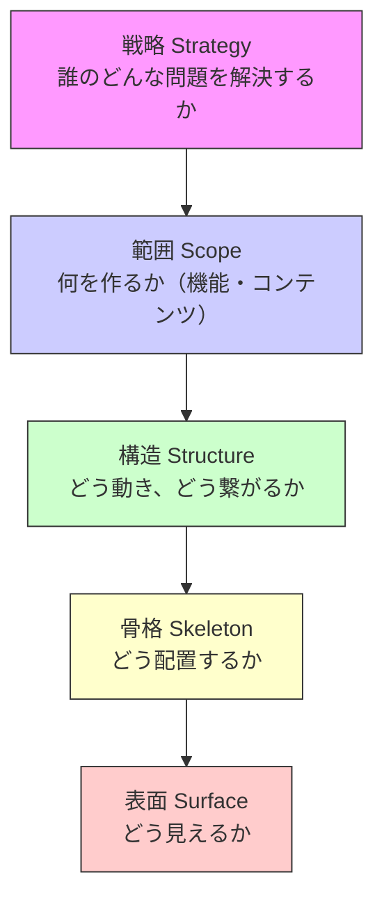

# UXデザインの5段階モデルまとめ

## 概要
UXデザインは一気にUIを作るのではなく、抽象から具体へと段階的に設計していく必要がある。  
5段階モデルは、その設計プロセスを以下のレイヤーに分けて整理したもの。
ジェシー・ジェームズ・ギャレットが提唱。

- 戦略（Strategy）
- 範囲（Scope）
- 構造（Structure）
- 骨格（Skeleton）
- 表面（Surface）

下位レイヤーほど具体的であり、上位レイヤーに依存している。

## 各レイヤーの理解

### 戦略（Strategy）
誰のどんな問題を、なぜ解決するのかを定義する段階。

- ユーザーのニーズ
- ビジネスの目標

このレイヤーがずれていると、見た目や使いやすさに問題がなくてもプロダクトは使われない。

### 範囲（Scope）
戦略を実現するために「何を作るのか」を決める段階。

- 機能要件
- コンテンツ要件

重要なのは単に機能を増減することではなく、戦略に対して必要なものだけを定義することである。

### 構造（Structure）
ユーザーの行動と情報の流れを設計する段階。

構造は以下の2つからなる：

- インタラクションデザイン（ユーザーの行動の流れ）
- 情報アーキテクチャ（情報の整理と構造）

この段階では見た目は扱わず、「どう動くか」「どう辿るか」を決める。

### 骨格（Skeleton）
構造で定義した内容を、画面上にどのように配置するかを決める段階

- ワイヤーフレーム
- レイアウト設計
- 情報の優先順位

UIの見た目ではなく、配置と構成を扱う

### 表面（Surface）
ユーザーが実際に触れるビジュアルデザインを定義する段階

- 色
- タイポグラフィ
- ビジュアル表現

もっとも具体的なレイヤーであり、他のすべてのレイヤーに依存する

## レイヤー間の関係

各レイヤーは独立しているのではなく、強く依存している

- 表面は骨格に依存する
- 骨格は構造に依存する
- 構造は範囲に依存する
- 範囲は戦略に依存する

そのため、下位レイヤーだけを改善しても、上位レイヤーに問題がある場合は根本的な解決にならない

## 問題解決における考え方

UX改善では「どのレイヤーに問題があるか」を特定することが重要である

### 原則
- 下位レイヤーから上位レイヤーの問題は解決できない
- 上位レイヤーの変更は影響範囲が広い

### 実務での判断
- ユーザーが来ない → 戦略 or 範囲
- 途中で離脱する → 構造 or 骨格
- 見た目の問題 → 表面

また、レイヤーは必要に応じて上下に行き来するが、無闇に行き来するのではなく、原因となるレイヤーを特定した上で最小限の範囲で見直すことが重要である。

## 学び

UXデザインはUIの改善ではなく、問題定義から始まる設計プロセスである。

とくに重要なのは以下の点である：

- 見た目の問題の多くは構造や戦略の問題である
- 構造は「見えない設計」であり、UXの質を大きく左右する
- 範囲は削ることではなく、戦略に適合させることが重要

## まとめ

UXの5段階モデルは、プロダクト設計において「どこに問題があるのか」を切り分けるためのフレームワークである。

このモデルを使うことで、表面的な改善に留まらず、より本質的な問題解決が可能になる。