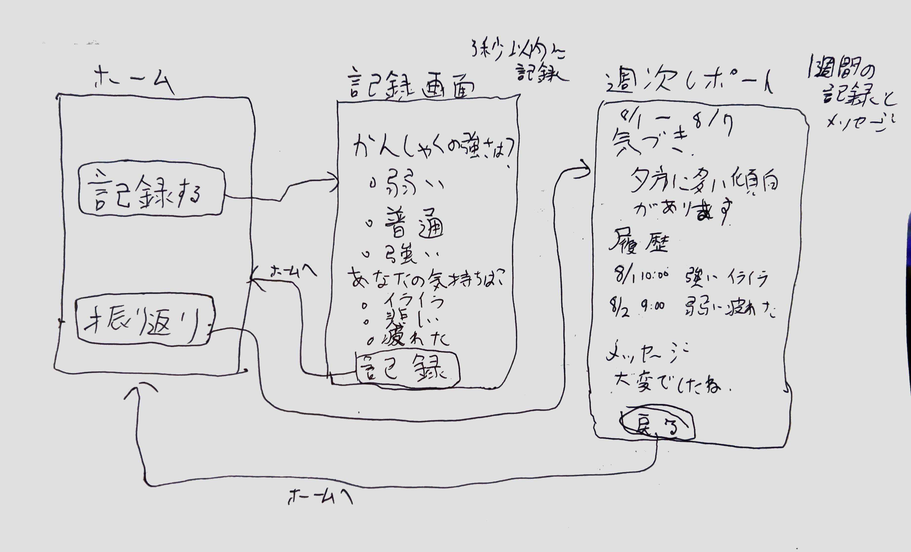

# Design

## 画面構成

本プロダクトは以下の3画面で構成する。

* ホーム
* 記録画面
* 振り返り画面

---

## 設計原則

* 操作は最小限にする
* ユーザーに考えさせない
* 感情的負担を増やさない

---

## 主要な設計判断

### 1. 入力を最小化

* テキスト入力を排除
* 選択式のみ

#### 理由

ユーザーは癇癪発生時に余裕がなく、複雑な操作は不可能なため

---

### 2. 振り返りは週次

* 日次ではなく週次に限定

#### 理由

感情的距離を確保し、冷静な振り返りを可能にするため

---

### 3. 分析を最小限にする

* グラフを排除
* シンプルなテキストで提示

#### 理由

認知負荷を下げ、直感的に理解できるようにするため

---

### 4. 感情への配慮

* 共感的なメッセージを表示

#### 理由

ユーザーは自己嫌悪を感じやすく、心理的負担の軽減が重要なため

---

## ワイヤーフレーム

---

## ユーザーフロー

### フロー①：癇癪の記録

1. ユーザーがホーム画面を開く
2. 「記録する」ボタンをタップ
3. 癇癪の強さと自身の感情を選択
4. 記録を保存
5. ホーム画面に戻る

#### 設計意図

* 3秒以内に記録が完了することを目指す
* 思考を必要としない選択式UIとする
* 記録後は即ホームに戻し、操作負担を最小化する

### フロー②：週次の振り返り

1. ユーザーがホーム画面を開く
2. 「振り返りを見る」をタップ
3. 週次の傾向と気づきを確認
4. ホーム画面に戻る

#### 設計意図

* 振り返りは1画面で完結させる
* 情報量を絞り、直感的に理解できるようにする
* 分析ではなく「気づき」を提供する

---

## 今後の改善余地

* 通知機能の検討
* 予兆検知の精度向上
